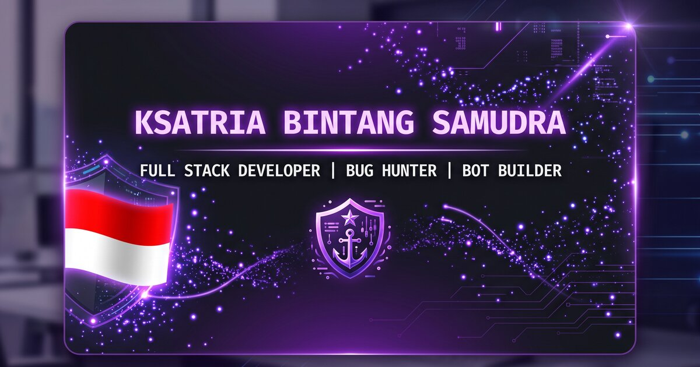

# 💻 Ksatria Bintang Samudra — Personal Branding

> **Full Stack Developer · Bug Hunter · Bot Builder** — Pontianak, Indonesia 🇮🇩
> *"Secure it. Build it. Automate it."*



---

## ✨ Highlights

- 🌍 **Bilingual** — English & Indonesia, auto-detect from browser, persist in `localStorage`
- 🌌 **Aurora hero background** + custom Linux X11 cursor + film grain overlay
- 🔦 **Spotlight cards** following cursor (Linear/Vercel style) — Projects, Certificates, Experience, About
- 🧲 **Magnetic CTA buttons** — pull subtly toward cursor
- ⌨️ **Cmd+K command palette** — fuzzy search across all navigation, lang toggle, social
- 🎮 **Konami code Easter egg** (`↑↑↓↓←→←→BA`) — opens playable hacker terminal
- 👋 **Tab title easter egg** when user switches tab
- 📊 **Scroll spy navbar** + reading progress bar
- 🌊 **View Transitions API** on language switch
- ⚡ **Code-split lazy loading** per section — initial JS bundle ~94 KB gzipped
- ♿ **Accessibility** — skip-to-content, focus rings, ARIA, reduced-motion respected

---

## 🚀 Tech Stack

| Layer | Technology |
|-------|------------|
| Framework | React 19 + TypeScript 5.9 |
| Build Tool | Vite 7 |
| Styling | Tailwind CSS 3.4 + custom CSS layer |
| Animation | GSAP + ScrollTrigger + Framer Motion |
| Icons | Lucide React + React Icons (Simple Icons) |
| i18n | Custom Context + hook (no library) |
| Fonts | JetBrains Mono + Inter (Google Fonts) |

---

## 📁 Project Structure

```
├── .github/workflows/
│   └── deploy.yml             # Auto-deploy to GH Pages
├── public/
│   ├── profile-photo.jpg      # 51 KB optimized
│   ├── og-image.jpg           # 113 KB OG preview
│   ├── robots.txt
│   └── sitemap.xml
├── src/
│   ├── components/
│   │   ├── Navbar.tsx         # Glassmorphism nav + scroll spy + lang toggle
│   │   ├── Footer.tsx
│   │   ├── Layout.tsx
│   │   ├── ReadingProgress.tsx
│   │   ├── KonamiTerminal.tsx # Easter egg
│   │   ├── CommandPalette.tsx # ⌘K
│   │   ├── SpotlightTracker.tsx
│   │   ├── Aurora.tsx
│   │   ├── Magnetic.tsx
│   │   └── TabTitleEgg.tsx
│   ├── sections/
│   │   ├── Hero.tsx
│   │   ├── About.tsx
│   │   ├── Skills/            # Folder: index + data + Terminal
│   │   ├── Experience.tsx
│   │   ├── Projects.tsx
│   │   ├── Certificates.tsx
│   │   └── Contact.tsx
│   ├── lib/
│   │   └── i18n.tsx           # Language context + view transitions
│   ├── locales/
│   │   ├── en.ts
│   │   └── id.ts
│   ├── hooks/
│   │   ├── use-active-section.ts
│   │   ├── use-reduced-motion.ts
│   │   └── use-mobile.ts
│   ├── index.css
│   └── main.tsx
└── index.html                 # SEO + JSON-LD + OG + Twitter
```

---

## 🛠 Development

```bash
npm install
npm run dev        # http://localhost:3000
npm run build      # production build
npm run preview    # preview production build locally
```

---

## 🌐 Deploy

This repo auto-deploys to **GitHub Pages** via `.github/workflows/deploy.yml` on every push to `main`.

To enable:
1. Push to a public GitHub repo
2. Go to **Settings → Pages → Source: GitHub Actions**
3. Done — every push to `main` rebuilds and publishes

---

## 🎨 Color Palette

| Token | Hex | Usage |
|-------|-----|-------|
| `--purple-500` | `#7C3AED` | Primary brand |
| `--purple-400` | `#A78BFA` | Accent highlights |
| `--purple-800` | `#4C1D95` | Gradient deep |
| `--orange-500` | `#F97316` | CTA / accent |
| `--bg-primary` | `#0A0A0A` | Page background |
| `--bg-secondary` | `#0D1117` | Section alt |

---

## 📄 License

MIT — feel free to fork as a template.

---

**Crafted by Ksatria Bintang Samudra** · Pontianak, Indonesia 🇮🇩
