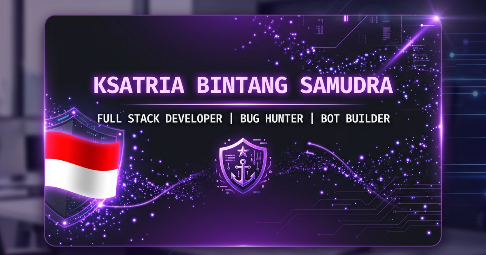

<p align="center">
  
</p>

<h1 align="center">Ksatria Bintang Samudra</h1>

<p align="center">
  <b>Full Stack Developer · Bug Hunter · Bot Builder</b><br>
  <sub>Pontianak, Indonesia 🇮🇩 — <i>"Secure it. Build it. Automate it."</i></sub>
</p>

<p align="center">
  <a href="https://ksatriabintangsamudra.my.id/"><b>🌐 Kunjungi Situs</b></a> &nbsp;·&nbsp;
  <a href="#-featured-projects"><b>🚀 Proyek</b></a> &nbsp;·&nbsp;
  <a href="https://github.com/Kstriabintang"><b>💼 GitHub</b></a>
</p>

<p align="center">
  <a href="https://ksatriabintangsamudra.my.id/"></a>
  
  
  
  
  
</p>

---

## ✨ Highlights

- 🌍 **Bilingual** — English & Indonesia, auto-detect from browser, persist in `localStorage`
- 🌌 **Aurora hero background** + custom Linux X11 cursor + film grain overlay
- 🔦 **Spotlight cards** following cursor (Linear/Vercel style) — Projects, Certificates, Experience, About
- 🧲 **Magnetic CTA buttons** — pull subtly toward cursor
- ⌨️ **Cmd+K command palette** — fuzzy search across all navigation, lang toggle, social
- 🎮 **Konami code Easter egg** (`↑↑↓↓←→←→BA`) — opens playable hacker terminal
- 📊 **Scroll spy navbar** + reading progress bar + View Transitions on language switch
- ⚡ **Code-split lazy loading** per section — initial JS bundle ~94 KB gzipped
- ♿ **Accessibility** — skip-to-content, focus rings, ARIA, reduced-motion respected

---

## 🚀 Featured Projects

Sebagian karya lain — selengkapnya di [profil GitHub](https://github.com/Kstriabintang?tab=repositories).

| Proyek | Deskripsi | Stack | Live |
|---|---|---|---|
| 📨 **Venmail** | Email sementara anonim (privacy-first) — inbox sekali pakai, real-time, auto-OTP, Developer API | React · Cloudflare | [venmail.my.id](https://venmail.my.id) |
| 🚗 **Makmur Motor** | Showroom mobil premium (Denpasar) + panel admin | Next.js 15 · CF Workers · D1/KV | [demo](https://makmur-motor.ksatriabintangsamudra2022.workers.dev) |
| 👗 **Luxafoir** | E-commerce fashion premium full-stack, animasi & conversion-optimized | Next.js 14 · Prisma · Midtrans | — |
| 🧲 **AR Medan Magnet** | WebAR edukasi medan magnet 3D (image tracking) + model .glb Assemblr | A-Frame · MindAR · Three.js | [adindautami.web.id](https://adindautami.web.id/) |
| 🕰️ **AR Bandul** | WebAR bandul/pendulum 3D untuk media ajar | A-Frame · MindAR | [chensqy.my.id](https://chensqy.my.id/) |

---

## 🧰 Tech Stack

| Layer | Technology |
|-------|------------|
| Framework | React 19 + TypeScript 5.9 |
| Build Tool | Vite 7 |
| Styling | Tailwind CSS 3.4 + custom CSS layer |
| Animation | GSAP + ScrollTrigger + Framer Motion |
| Icons | Lucide React + React Icons (Simple Icons) |
| i18n | Custom Context + hook (no library) |
| Fonts | JetBrains Mono + Inter (Google Fonts) |

---

## 🛠 Development

```bash
npm install
npm run dev        # http://localhost:3000
npm run build      # production build
npm run preview    # preview production build locally
```

Auto-deploy ke **GitHub Pages** lewat `.github/workflows/deploy.yml` setiap push ke `main`
(**Settings → Pages → Source: GitHub Actions**). Domain kustom: `ksatriabintangsamudra.my.id`.

---

## 🗂️ Project Structure

```
├── .github/workflows/deploy.yml   # Auto-deploy ke GH Pages
├── public/                        # profile-photo, og-image, robots, sitemap
├── src/
│   ├── components/                # Navbar, Aurora, Magnetic, CommandPalette (⌘K),
│   │                              # KonamiTerminal, SpotlightTracker, ReadingProgress…
│   ├── sections/                  # Hero, About, Skills, Experience, Projects, Certificates, Contact
│   ├── lib/i18n.tsx               # Language context + view transitions
│   ├── locales/                   # en.ts · id.ts
│   └── hooks/                     # use-active-section, use-reduced-motion, use-mobile
└── index.html                     # SEO + JSON-LD + OG + Twitter
```

---

## 🎨 Color Palette

| Token | Hex | Usage |
|-------|-----|-------|
| `--purple-500` | `#7C3AED` | Primary brand |
| `--purple-400` | `#A78BFA` | Accent highlights |
| `--orange-500` | `#F97316` | CTA / accent |
| `--bg-primary` | `#0A0A0A` | Page background |

---

## 📄 License

MIT — feel free to fork as a template.

<p align="center"><sub><b>Crafted by Ksatria Bintang Samudra</b> · Pontianak, Indonesia 🇮🇩</sub></p>
