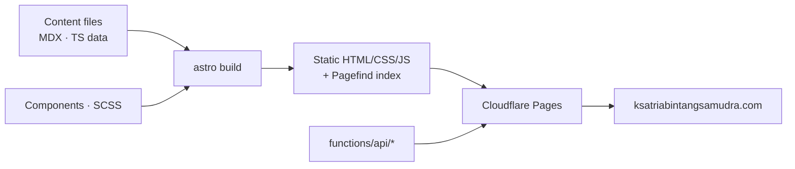
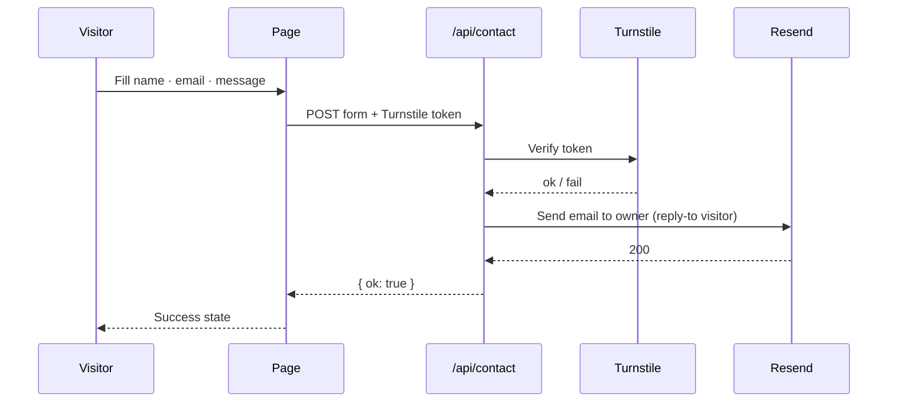
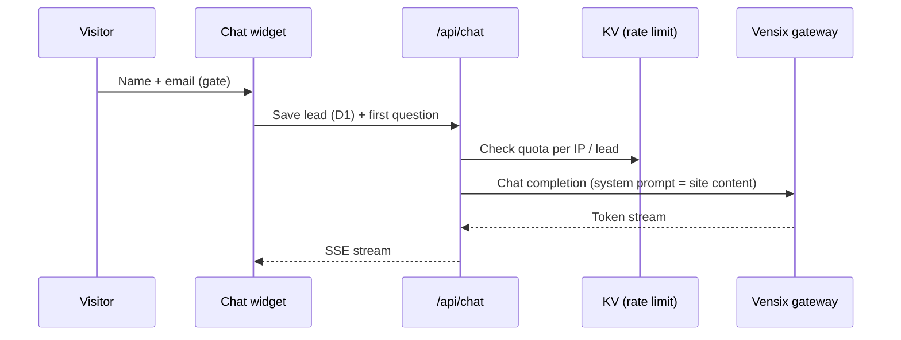

<h1 align="center">ksatriabintangsamudra.com</h1>

<p align="center">
  <b>Personal site v2 of Ksatria Bintang Samudra</b><br>
  <sub>AI Engineer · Automation Builder · Solutions Architect — Pontianak, Indonesia 🇮🇩</sub>
</p>

<p align="center">
  
  
  
  
  
</p>

> [!IMPORTANT]
> **This branch (`v2-astro`) is a rebuild in progress. Nothing described below is finished yet.**
> The current live site (React + Vite) is still served from `main` at
> [ksatriabintangsamudra.my.id](https://ksatriabintangsamudra.my.id) until the Phase 1 cutover.
> This README is the blueprint the rebuild is developed against — check the [Roadmap](#-roadmap) for real progress.

---

## 📑 Table of Contents

1. [Overview & Goals](#-overview--goals)
2. [Features](#-features)
3. [Tech Stack](#-tech-stack)
4. [Design System](#-design-system)
5. [Pages & Sections](#-pages--sections)
6. [Project Structure](#-project-structure)
7. [Architecture & Workflow](#-architecture--workflow)
8. [Content Model](#-content-model)
9. [API & Data](#-api--data)
10. [Environment Variables](#-environment-variables)
11. [Setup & Installation](#-setup--installation)
12. [Development Workflow](#-development-workflow)
13. [Deployment & Domain](#-deployment--domain)
14. [Roadmap](#-roadmap)
15. [Content Needed From Owner](#-content-needed-from-owner)
16. [Quality Bar](#-quality-bar)
17. [Screenshots](#-screenshots)
18. [Credits & License](#-credits--license)

---

## 🎯 Overview & Goals

A full rebuild of Ksatria's personal site as a **multi-page Astro site** on a new professional domain,
**[ksatriabintangsamudra.com](https://ksatriabintangsamudra.com)**, aimed at international (remote, USD) clients and employers.

The layout, typography, color system, motion and interaction model **replicate
[kunalganglani.com](https://www.kunalganglani.com/) one-to-one** (dark navy + teal, Fraunces / Montserrat / monospace,
starfield hero, numbered serif section heads, case-study pages, services page). All **content** — words, numbers,
projects and photos — is Ksatria's own.

### Goals

| # | Goal | How we know it's met |
|---|------|----------------------|
| G1 | **Visual parity** with the reference design | Side-by-side screenshots at 1440 px and 390 px, dark and light mode, match section-for-section |
| G2 | **Every claim is verifiable** | No inflated titles, certificates or metrics; each number traces to a repo, live URL or document |
| G3 | **Show real, shipped work** | Each featured project has a case-study page plus a live / demo link where one exists |
| G4 | **Fast and accessible** | Lighthouse ≥ 95 for Performance, Accessibility, Best Practices and SEO on the home page |
| G5 | **Clean cutover** | Live on `ksatriabintangsamudra.com`; the old `.my.id` domain 301-redirects with paths preserved |

### Non-goals (for now)

- Blog / writing hubs, tools & games catalogues with invented content — those arrive only when real content exists (Phase 3).
- A CMS. Content lives in the repo as typed files until volume justifies one.
- Multi-language. The site is **English-only**, like the reference.

---

## ✨ Features

### Phase 1 — Core site (launch)

- **Hero** — twinkling starfield canvas + "north star" sparkle (dark) / drifting cloudfield (light), mono eyebrow,
  Fraunces headline with one italic gradient word, typed `$ whoami →` role rotator, proof strip, circular photo with a
  spinning dashed ring, orbiting dot and a pulsing availability pill. Until Phase 2 adds the "Explain it" input, that
  slot holds a one-line value proposition and two pill buttons (`View selected work →`, `Let's talk`).
- **Navbar** — glassy fixed bar that shrinks and hides on scroll, dropdown groups Work · Playground · About
  (Writing joins in Phase 3, giving the reference's four), gradient `LET'S TALK` pill, search button with `⌘K` hint,
  terminal button, theme toggle, mobile hamburger drawer.
- **⌘K search palette** — full-text search over pages and projects (Pagefind index, built at compile time).
- **Terminal** — `>_` button (and the Konami code) opens an interactive terminal: `help`, `whoami`, `ls`, `cat`, `projects`, `contact`, `clear`, `exit`.
- **Light / dark theme** — dark by default, persisted in `localStorage`, animated icon swap, no flash on load.
- **Scroll progress bar** — 3 px teal gradient at the very top.
- **Playground** — cards for tools Ksatria built and that run in the browser today (poster image, category, one-liner, `OPEN →`, `LIVE`/`NEW` badges).
- **Selected work** — filter pills (All · AI & Automation · Web · Mobile · Security), cards with metric badge, gradient header, tags and `VIEW CASE STUDY → · LIVE ↗ · DEMO ↗ · SOURCE` links.
- **Case-study pages** — `/projects/<slug>`: The Challenge → My Approach → The Results, key metrics, tech stack, related projects.
- **Who I am** — bio card, quick-facts grid, lifestyle photos with mono captions, "Uses / Resume / GitHub" link cards,
  and the auto-scrolling **"Currently"** marquee (Building · Reading · Watching · Craving · Next trip).
- **Toolkit** — skill groups split into **Core focus** and **Foundations**, rendered as dot pills.
- **Where I've wandered** — dotted 3-D globe with markers, country pills and totals.
- **Let's connect** — serif headline, contact meta, fun fact, `Schedule a call` + `Email me`, and a working contact form
  (Cloudflare Turnstile + email delivery).
- **Footer** — four link columns, serif italic tagline, social icons, copyright line.
- **Pages** — `/projects`, `/services`, `/about`, `/uses`, `/resume`, `/privacy`, `404`.
- **SEO** — per-page titles/descriptions, Open Graph + Twitter cards, JSON-LD (`Person`, `WebSite`, `CreativeWork`), sitemap, robots, canonical URLs.

### Phase 2 — AI features

- **"Ask me anything" chat widget** — floating bubble; collects name + email first ("Before we chat…"), then streams
  answers about Ksatria's work from an LLM grounded on the site's own content. Powered by **Vensix** (Ksatria's
  OpenAI-compatible gateway) — itself a showcase of the AI-engineering positioning.
- **"Explain it" hero input** — type a topic, get a simple explanation plus a Mermaid diagram.
- Rate limiting, abuse protection and lead storage.

### Phase 3 — Writing

- **From the notebook** home section, `/blog`, post pages, tags, RSS, reading time.
- Additional hubs (tools catalogue, demos) only once there is real content to fill them.

---

## 🧰 Tech Stack

| Layer | Choice | Why |
|-------|--------|-----|
| Framework | **Astro 5+** (static output) | Same as the reference; zero-JS by default, file-based routing, content collections |
| Language | **TypeScript** (strict) | Typed content schemas and components |
| Styling | **SCSS** + CSS custom properties | Mirrors the reference's token-driven styles; theme switch via `[data-theme]` |
| Interactive islands | **React** (only where needed) | ⌘K palette, terminal, chat widget |
| Search | **Pagefind** | Static full-text index for the ⌘K palette, no server |
| Globe | **cobe** | ~5 KB WebGL dotted globe with markers |
| Canvas effects | Hand-written starfield / cloudfield | Paused off-screen and under `prefers-reduced-motion` |
| Fonts | **Fraunces** (roman + italic, variable), **Montserrat** (variable), system `ui-monospace` | Self-hosted `woff2`, preloaded |
| Content | **Astro Content Collections** (Markdown/MDX + Zod) | Projects, tools, pages as typed files |
| Hosting | **Cloudflare Pages** | DNS already on Cloudflare; Pages Functions for the form and AI endpoints |
| Server functions | **Cloudflare Pages Functions** | `/api/contact` (Phase 1), `/api/chat`, `/api/explain` (Phase 2) |
| Email | **Resend** | Contact-form delivery |
| Bot protection | **Cloudflare Turnstile** | Contact form and chat gate |
| Storage (Phase 2) | **Cloudflare KV** (rate limits) · **D1** (chat leads) | Native to Pages Functions |
| LLM (Phase 2) | **Vensix** gateway (OpenAI-compatible) | Model routing and cost metering already built |
| Analytics | **Cloudflare Web Analytics** | Cookie-less |
| Testing | **Playwright** (e2e + visual), **Vitest** (units), **Lighthouse CI** | See [Quality Bar](#-quality-bar) |

Exact package versions are pinned during Phase 0 and recorded in `package.json`.

---

## 🎨 Design System

Extracted from the reference site (computed styles, September 2026). `html { font-size: 62.5% }` so `1rem = 10px`.

### Color tokens

| Token | Dark (default) | Light |
|-------|----------------|-------|
| `--bg-primary` | `#0f0f1a` | `#ffffff` |
| `--bg-secondary` (alternating sections) | `#141425` | `#f8f9fa` |
| `--card-bg` | `#1a1a30` | `#f8f9fa` |
| `--card-border` | `rgba(255,255,255,.06)` | `rgba(0,0,0,.06)` |
| `--text-primary` | `#e8e8ec` | `#272341` |
| `--text-secondary` | `#a0a0b8` | `#333333` |
| `--color-primary` | `#00d9ce` | `#02aab0` |
| `--color-accent` | `#818cf8` | `#6366f1` |
| Brand gradient | `linear-gradient(120deg, #02aab0, #00cdac)` | same |
| Contact section | `#0a0a12` + radial teal glow | — |
| Availability green | `#10b981` | same |

### Typography

| Role | Font | Spec |
|------|------|------|
| Display / H1 | Fraunces 600 | `6.4rem`, line-height 1.08, letter-spacing −0.02em; one `<em>` word italic with the brand gradient |
| Section title | Fraunces 600 | `clamp(2.8rem, 3.2vw, 3.8rem)`, italic gradient `<em>` |
| Card title | Fraunces 600 | ~`2.2rem` |
| Body | Montserrat 400/500 | `1.6rem`, secondary color |
| Eyebrows, labels, chips, nav, section numbers | `ui-monospace` | uppercase, letter-spacing `0.07–0.16em`, `1.0–1.5rem` |

### Shape, depth & motion

- **Radii** — cards `16px`, link cards `14px`, inputs `10px`, buttons/pills `99px`.
- **Shadows** — `0 1px 3px rgba(0,0,0,.12)` · `0 4px 14px rgba(0,0,0,.16)` · `0 12px 34px rgba(0,0,0,.22)`; primary buttons add `0 8px 30px rgba(2,170,176,.28)`.
- **Easing** — `--ease-out: cubic-bezier(.16,1,.3,1)`, `--ease-spring: cubic-bezier(.34,1.56,.64,1)`; durations `.15s / .3s / .6s`.
- **Section head** — mono number (`01`) + serif title + hairline rule filling the remaining width.
- **Motion inventory** — hero words rise in, caret blink, ring spin, availability pulse, north-star breathe,
  marquee scroll (32 s, pauses on hover), nav dropdown fade/slide, card lift on hover, scroll-bounce chevron.
  All of it is disabled or reduced under `prefers-reduced-motion`.

---

## 🗺️ Pages & Sections

### Home (`/`) — section order

| Order | Section | Heading | Phase |
|-------|---------|---------|-------|
| 1 | Hero | display headline | 1 (input added in 2) |
| 2 | Playground | "Tools you can *use right now*" | 1 |
| 3 | From the notebook | `05` From the *notebook* | 3 (hidden until then) |
| 4 | Selected work | `04` Selected *work* | 1 |
| 5 | Who I am + Currently marquee | `01` Who *I am* | 1 |
| 6 | Toolkit | `02` My *toolkit* | 1 |
| 7 | Where I've wandered | `03` Where I've *wandered* | 1 |
| 8 | Let's connect | `06` Let's *connect* | 1 |
| 9 | Footer | — | 1 |

Section numbers deliberately follow the reference (non-sequential on the page).

### Other routes

| Route | Content | Phase |
|-------|---------|-------|
| `/projects` | Intro + filter + full project grid | 1 |
| `/projects/<slug>` | Case study (Challenge → Approach → Results, metrics, stack, related) | 1 |
| `/services` | "Work with me": offers, 3-step process (intro call → scoped proposal → delivery), CTA | 1 |
| `/about` | Longer bio, quick facts, expertise, "What I've shipped" | 1 |
| `/uses` | Hardware, editor, terminal, AI tools, stack, "This site" | 1 |
| `/resume` | Web resume + PDF download; only verifiable credentials | 1 |
| `/privacy` | What the contact form and chat store | 1 |
| `/404` | Themed not-found page | 1 |
| `/blog`, `/blog/<slug>`, `/rss.xml` | Writing | 3 |

### Navigation

| Group | Items (Phase 1) |
|-------|-----------------|
| Work | Projects · Services · Resume |
| Playground | Tools (links to the live tools) |
| About | About · Uses |
| CTA | `LET'S TALK` → `#contact` |

Groups gain items only when the page behind them exists.

---

## 🗂️ Project Structure

Target layout after Phase 0 scaffolding:

```text
.
├── astro.config.mjs            # site URL, integrations (react, sitemap, mdx), output: static
├── wrangler.toml               # Pages Functions bindings (KV, D1) — Phase 2
├── package.json
├── tsconfig.json
├── public/
│   ├── fonts/                  # fraunces.woff2, fraunces-italic.woff2, montserrat.woff2
│   ├── images/                 # profile, lifestyle photos, project covers, tool posters
│   ├── cv/                     # resume PDF
│   ├── favicon.svg · og-image.png · robots.txt · _redirects · _headers
├── functions/
│   └── api/
│       ├── contact.ts          # Phase 1 — Turnstile verify → Resend
│       ├── chat.ts             # Phase 2 — streaming chat via Vensix
│       └── explain.ts          # Phase 2 — topic → explanation + Mermaid
├── src/
│   ├── content.config.ts       # Zod schemas for all collections
│   ├── content/
│   │   ├── projects/           # one .mdx per case study
│   │   ├── tools/              # playground entries
│   │   └── blog/               # Phase 3
│   ├── data/
│   │   ├── site.ts             # name, roles, proof strip, socials, availability
│   │   ├── about.ts            # bio, quick facts, currently, photos + captions
│   │   ├── toolkit.ts          # core focus / foundations groups
│   │   ├── travel.ts           # countries, cities, globe markers
│   │   ├── services.ts         # offers + process
│   │   ├── uses.ts
│   │   └── nav.ts              # navbar groups + footer columns
│   ├── layouts/
│   │   ├── BaseLayout.astro    # <head>, SEO, theme bootstrap, navbar, footer
│   │   └── CaseStudyLayout.astro
│   ├── components/
│   │   ├── nav/                # Navbar, Dropdown, MobileDrawer, ThemeToggle
│   │   ├── hero/               # Hero, Starfield, Cloudfield, RoleTyper, PhotoRing
│   │   ├── home/               # Playground, SelectedWork, WhoIAm, Currently, Toolkit, Wandered, Connect
│   │   ├── ui/                 # SectionHead, Pill, Button, Card, Badge, MetricBadge
│   │   ├── islands/            # CommandPalette.tsx, Terminal.tsx, ChatWidget.tsx (Phase 2)
│   │   └── Footer.astro
│   ├── pages/
│   │   ├── index.astro
│   │   ├── projects/index.astro
│   │   ├── projects/[slug].astro
│   │   ├── services.astro · about.astro · uses.astro · resume.astro · privacy.astro · 404.astro
│   ├── scripts/                # scroll progress, navbar hide/shrink, reveal-on-scroll
│   └── styles/
│       ├── tokens.scss         # colors, type scale, spacing, radii, shadows, easing
│       ├── global.scss         # reset, base typography, theme switch
│       └── components/         # one partial per component family
├── tests/
│   ├── e2e/                    # Playwright flows (nav, ⌘K, theme, form)
│   └── visual/                 # screenshot comparisons vs. docs/reference/
├── docs/
│   ├── reference/              # reference screenshots used for visual parity (not deployed)
│   └── screenshots/            # screenshots of THIS site — added after the UI exists
└── .github/workflows/ci.yml    # typecheck, build, Playwright, Lighthouse
```

---

## 🔄 Architecture & Workflow

### Build & deploy


```mermaid
flowchart LR
  A[Content files<br/>MDX · TS data] --> B[astro build]
  S[Components · SCSS] --> B
  B --> C[Static HTML/CSS/JS<br/>+ Pagefind index]
  C --> D[Cloudflare Pages]
  F[functions/api/*] --> D
  D --> E[ksatriabintangsamudra.com]
```

Every push to a branch gets a Cloudflare preview URL; `main` is production.

### Contact form (Phase 1)


```mermaid
sequenceDiagram
  participant V as Visitor
  participant P as Page
  participant F as /api/contact
  participant T as Turnstile
  participant R as Resend
  V->>P: Fill name · email · message
  P->>F: POST form + Turnstile token
  F->>T: Verify token
  T-->>F: ok / fail
  F->>R: Send email to owner (reply-to visitor)
  R-->>F: 200
  F-->>P: { ok: true }
  P-->>V: Success state
```

### AI chat (Phase 2)


```mermaid
sequenceDiagram
  participant V as Visitor
  participant W as Chat widget
  participant F as /api/chat
  participant K as KV (rate limit)
  participant G as Vensix gateway
  V->>W: Name + email (gate)
  W->>F: Save lead (D1) + first question
  F->>K: Check quota per IP / lead
  F->>G: Chat completion (system prompt = site content)
  G-->>F: Token stream
  F-->>W: SSE stream
```

---

## 🧱 Content Model

Content is validated at build time; a missing or wrong field fails the build.

### `projects` collection (`src/content/projects/*.mdx`)

| Field | Type | Notes |
|-------|------|-------|
| `title` | string | Card + page title |
| `summary` | string | 1–2 sentences on the card |
| `category` | `"ai-automation" \| "web" \| "mobile" \| "security"` | Drives filter pills |
| `metric` | string | Badge on the card, e.g. `247 TESTS` — must be verifiable |
| `tags` | string[] | Mono chips |
| `cover` | `{ gradient: [string, string], icon: string }` or image | Card header |
| `links` | `{ live?, demo?, source?, caseStudy: true }` | Only real URLs |
| `client` | `{ name?: string, anonymised: string }` | Named only with the client's permission |
| `year` | number | |
| `metrics` | `{ label, value }[]` | Case-study metric row |
| `stack` | string[] | Case-study tech list |
| `featured`, `order` | boolean, number | Home grid selection and ordering |
| body | MDX | `## The Challenge`, `## My Approach`, `## The Results` |

### Other collections & data

- **`tools`** — `title`, `category`, `blurb`, `poster`, `url`, `badge` (`LIVE` / `NEW`).
- **`site.ts`** — name, eyebrow, headline + italic word, rotating roles, proof strip, availability text, socials, email.
- **`about.ts`** — bio paragraphs, quick facts, "currently" items, photos with captions.
- **`toolkit.ts`**, **`travel.ts`**, **`services.ts`**, **`uses.ts`**, **`nav.ts`**.

### Initial project list (Phase 1)

| Project | Category | Live / demo |
|---------|----------|-------------|
| CoalTrack — anti-fraud workforce & payroll for mining | mobile | coaltrack.id · demo.coaltrack.id |
| Vensix — OpenAI-compatible AI gateway | ai-automation | vensix.biz.id |
| Makmur Motor — edge car showroom & CMS | web | makmurmotor.biz.id |
| Lavelle — digital wedding invitation platform | web | lavelle.my.id |
| Wedding Saving — QRIS savings with Telegram automation | ai-automation | demo.weddingsaving.my.id |
| Phishing Threat-Intel Case Files | security | GitHub repo |
| AR Science Lab — browser AR teaching suite | web | utamiii.my.id |

Playground tools: DevSec Toolbox, HAND//TRACE, ResumeKita.

---

## 🔌 API & Data

Phase 1 has **no database** — everything is static except the contact form.

| Endpoint | Method | Phase | Purpose | Storage |
|----------|--------|-------|---------|---------|
| `/api/contact` | POST | 1 | Verify Turnstile, send email via Resend | none |
| `/api/chat` | POST (SSE) | 2 | Streamed answers grounded on site content | KV (rate limit), D1 (`leads`) |
| `/api/explain` | POST | 2 | Topic → explanation + Mermaid diagram | KV (rate limit, cache) |

**D1 `leads` table (Phase 2)**

| Column | Type |
|--------|------|
| `id` | INTEGER PRIMARY KEY |
| `name` | TEXT NOT NULL |
| `contact` | TEXT NOT NULL (email or phone) |
| `created_at` | TEXT (ISO 8601) |
| `source` | TEXT (`chat` / `explain`) |

All endpoints return `{ ok: boolean, error?: string }`, validate input with Zod, and never echo secrets.

---

## 🔐 Environment Variables

Set in **Cloudflare Pages → Settings → Variables and Secrets**. Locally, put them in `.dev.vars`
(git-ignored). Never commit real values.

| Variable | Phase | Scope | Description |
|----------|-------|-------|-------------|
| `PUBLIC_SITE_URL` | 1 | build | `https://ksatriabintangsamudra.com` |
| `PUBLIC_TURNSTILE_SITE_KEY` | 1 | build (public) | Turnstile widget key |
| `TURNSTILE_SECRET_KEY` | 1 | function secret | Server-side Turnstile verification |
| `RESEND_API_KEY` | 1 | function secret | Sends contact-form email |
| `CONTACT_TO_EMAIL` | 1 | function | Inbox that receives messages |
| `CONTACT_FROM_EMAIL` | 1 | function | Verified sender on the new domain |
| `VENSIX_API_KEY` | 2 | function secret | Gateway key (`sk-vsx-…`) |
| `VENSIX_BASE_URL` | 2 | function | `https://vensix.biz.id/v1` |
| `CHAT_MODEL` | 2 | function | Model id routed through Vensix |
| `RATE_LIMIT` | 2 | KV binding | Per-IP / per-lead quotas |
| `DB` | 2 | D1 binding | `leads` table |

A committed `.dev.vars.example` lists the names with empty values.

---

## 🛠️ Setup & Installation

### Prerequisites

- Node.js **22 LTS** and npm
- A Cloudflare account (for Pages, Turnstile, Functions)
- `wrangler` (installed as a dev dependency) for running functions locally

### Commands

```bash
git clone https://github.com/Kstriabintang/Kstriabintang.github.io.git
cd Kstriabintang.github.io
git switch v2-astro

npm install
cp .dev.vars.example .dev.vars      # fill in values for local testing

npm run dev          # Astro dev server — http://localhost:4321
npm run build        # static build to dist/ + Pagefind index
npm run preview      # wrangler pages dev dist — site + functions locally
npm run check        # astro check (types + content schemas)
npm run test         # Vitest
npm run test:e2e     # Playwright e2e + visual
```

---

## 🧭 Development Workflow

1. Work on a feature branch off `v2-astro` (after launch: off `main`).
2. `npm run check && npm run test && npm run test:e2e` must pass before merging.
3. Compare against `docs/reference/` screenshots for every UI change.
4. Push → Cloudflare preview URL → review → merge.

### Commit policy

- Commits are authored **only** by the owner: `Ksatria Bintang Samudra <ksatriabintangsamudra2022@gmail.com>`.
- No `Co-authored-by` trailers, and no bot or AI identities as author or co-author.
- Conventional messages: `feat:`, `fix:`, `style:`, `content:`, `chore:`, `docs:`.

### Content rules

- Every number, title and credential must be verifiable. Course completions are labelled as courses, not certifications.
- Client names appear only with written permission; otherwise use the anonymised description.
- No personal data beyond what's meant to be public (no date of birth, IDs or payslips in assets).

---

## 🚀 Deployment & Domain

| Item | Value |
|------|-------|
| Production domain | `ksatriabintangsamudra.com` (Cloudflare Registrar, registered 2026-09-25) |
| `www` | 301 → apex |
| Hosting | Cloudflare Pages project, production branch `main` |
| Old domain | `ksatriabintangsamudra.my.id/*` → 301 → `ksatriabintangsamudra.com/$1` |
| Old hosting | GitHub Pages workflow and `CNAME` files removed after cutover |

### Cutover checklist (end of Phase 1)

- [ ] Parity + quality checks pass on the preview URL
- [ ] Merge `v2-astro` → `main`; Pages production deploy succeeds
- [ ] Attach `ksatriabintangsamudra.com` and `www` to the Pages project
- [ ] Redirect rule on `.my.id` (path + query preserved), keep the old domain renewed ≥ 12 months
- [ ] Remove GitHub Pages workflow and `CNAME`; disable Pages in repo settings
- [ ] Email routing + SPF/DKIM/DMARC for the new domain; verify Resend sender
- [ ] Google Search Console: add property, submit sitemap, run Change of Address
- [ ] Update links: GitHub profile, repo homepage, LinkedIn, CV PDF, social bios

---

## 🛣️ Roadmap

### Phase 0 — Foundation
- [x] Reference design extracted (tokens, typography, components, motion)
- [x] Domain `ksatriabintangsamudra.com` registered
- [ ] Scaffold Astro + TypeScript + SCSS + React integration on `v2-astro`
- [ ] Self-host fonts; implement `tokens.scss` / `global.scss` and the theme bootstrap
- [ ] Cloudflare Pages project connected to the repo with preview deploys
- [ ] CI: typecheck, build, Playwright smoke test
- [ ] Capture reference screenshots into `docs/reference/`

### Phase 1 — Core site (launch)
- [ ] **M1 Shell** — BaseLayout, SEO head, navbar (dropdowns, shrink/hide, mobile drawer), footer, scroll progress, theme toggle
- [ ] **M2 Hero** — starfield/cloudfield, north star, headline animation, role typer, proof strip, photo ring, availability pill
- [ ] **M3 Content** — collections + schemas, project MDX files, data files
- [ ] **M4 Home sections** — Playground, Selected work (filters), Who I am + Currently, Toolkit, Wandered (globe), Let's connect
- [ ] **M5 Pages** — `/projects`, case studies, `/services`, `/about`, `/uses`, `/resume`, `/privacy`, `404`
- [ ] **M6 Interactions** — ⌘K palette (Pagefind), terminal + Konami
- [ ] **M7 Contact** — `/api/contact` with Turnstile + Resend
- [ ] **M8 Quality** — visual parity, Lighthouse ≥ 95, accessibility pass, reduced motion
- [ ] **M9 Launch** — cutover checklist above

### Phase 2 — AI features
- [ ] Chat widget UI + lead gate
- [ ] `/api/chat` via Vensix with streaming, grounding on site content, KV rate limit, D1 leads
- [ ] "Explain it" hero input + `/api/explain` with Mermaid rendering
- [ ] Abuse tests and cost ceiling

### Phase 3 — Writing
- [ ] Blog collection, post layout, RSS, tags
- [ ] "From the notebook" home section (visible once ≥ 3 posts exist)
- [ ] Further hubs only with real content

---

## 📸 Content Needed From Owner

| Item | Spec | Used in |
|------|------|---------|
| Hero headshot | Square, ≥ 800 × 800, dark background, dark outfit, face centred | Hero photo ring, OG image, chat avatar |
| 2–3 lifestyle photos | Portrait or landscape, ≥ 1200 px, e.g. city at night, a landmark | Who I am |
| Quick facts | 6 short facts (number + label) | Who I am |
| Currently | Building · Reading · Watching · Craving · Next trip | Marquee |
| Travel | Countries + cities visited | Wandered globe |
| Client permissions | Yes/no per client name | Case studies |
| Services | Offer names, scope, engagement model | `/services` |
| Contact inbox | Address on the new domain | Contact form, footer |

---

## ✅ Quality Bar

| Check | Tool | Target |
|-------|------|--------|
| Visual parity with reference | Playwright screenshots (1440 & 390, dark & light) | Section-for-section match |
| Performance / A11y / Best practices / SEO | Lighthouse CI | ≥ 95 each on `/` |
| Types & content schemas | `astro check` | 0 errors |
| Links | Link checker in CI | 0 broken internal links |
| Motion safety | Manual + e2e with `prefers-reduced-motion` | Canvas effects paused, no autoplay motion |
| Keyboard | e2e | Nav, dropdowns, ⌘K, terminal, form fully operable |

---

## 🖼️ Screenshots

> No screenshots yet — the UI has not been built. They will be added after Phase 1 milestones land.

Store images in [`docs/screenshots/`](docs/screenshots/) with this naming:

| File | Shows |
|------|-------|
| `home-desktop-dark.png` | Home, 1440 px, dark |
| `home-desktop-light.png` | Home, 1440 px, light |
| `home-mobile-dark.png` | Home, 390 px, dark |
| `projects.png` | `/projects` grid |
| `case-study.png` | A case-study page |
| `services.png` | `/services` |
| `command-palette.png` | ⌘K palette open |
| `terminal.png` | Terminal open |
| `chat-widget.png` | Phase 2 chat |

---

## 📄 Credits & License

- Layout and design language modelled on [kunalganglani.com](https://www.kunalganglani.com/) by Kunal Ganglani.
- **Code**: MIT — see [LICENSE](LICENSE).
- **Content, photos and personal data**: © Ksatria Bintang Samudra, all rights reserved. Not covered by the MIT license.

<p align="center"><sub>Built in Pontianak, Indonesia 🇮🇩</sub></p>
